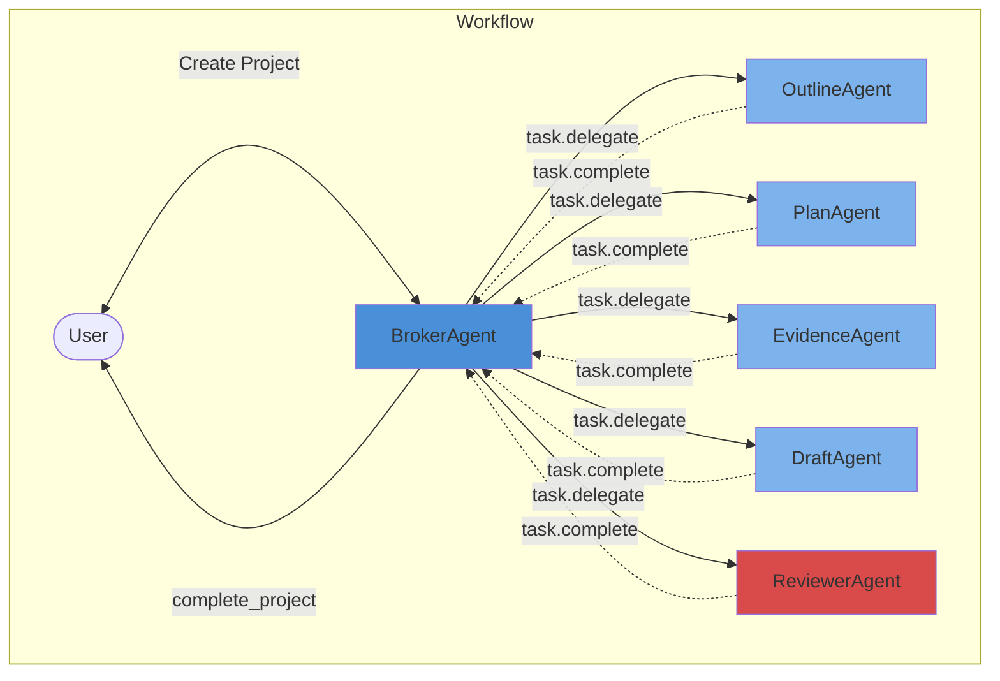
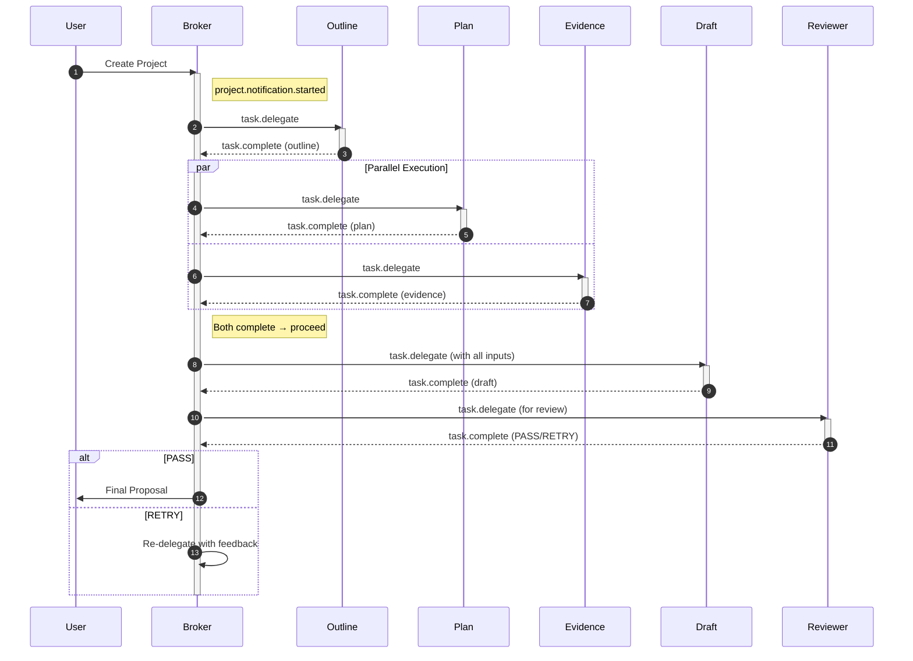

# PlanWeaver

本项目为 OpenAgents Multi-Agent Hackathon 2025 的参赛作品「PlanWeaver」。它展示了一个基于事件驱动的协作 Agent 网络，能够根据简单的用户简报生成全面的方案提案（支持商业提案、活动策划、项目启动等多种场景）。

## 架构

该网络由以下 Agent 组成：

1.  **BrokerAgent (`broker_agent`)**：协调者。接收项目启动事件，通过事件分派任务，跟踪完成状态，编译最终结果。
2.  **OutlineAgent (`outline_agent`)**：大纲生成器。根据用户简报创建提案结构框架。
3.  **EvidenceAgent (`evidence_agent`)**：证据收集器。收集支持性信息、行业背景和参考数据。
4.  **PlanAgent (`plan_agent`)**：计划制定器。制定时间表、预算、资源需求和风险评估。
5.  **DraftAgent (`draft_agent`)**：文档汇编器。整合所有输入生成最终提案文档。
6.  **ReviewerAgent (`reviewer_agent`)**：质量审查器。验证输出质量，提供 PASS/RETRY 反馈。

### 核心协作流程图



### 事件驱动工作流



### 工作流程说明

1. **项目启动**：用户创建项目，触发 `project.notification.started` 事件
2. **大纲生成**：Broker 委派 Outline Agent 创建提案结构
3. **并行执行**：Plan 和 Evidence Agent 同时工作（无依赖关系）
4. **文档汇编**：Draft Agent 整合所有输入生成最终提案
5. **质量审查**：Reviewer Agent 验证质量
6. **完成或重试**：根据审查结果完成项目或要求修订

## 项目结构

```text
PlanWeaver/
├── agents/                    # Agent YAML 配置文件
│   ├── broker_agent.yaml      # 协调者配置
│   ├── outline_agent.yaml     # 大纲生成器配置
│   ├── evidence_agent.yaml    # 证据收集器配置
│   ├── plan_agent.yaml        # 计划制定器配置
│   ├── draft_agent.yaml       # 文档汇编器配置
│   └── reviewer_agent.yaml    # 质量审查器配置
├── tools/                     # 工具函数
│   ├── __init__.py
│   └── proposal_helpers.py    # 提案辅助函数
├── network.yaml               # OpenAgents 网络配置
└── README.md                  # 项目文档
```

## 安装与运行

### 前置条件

*   已安装 Conda（建议 `miniconda`/`anaconda`）
*   Python 3.12+
*   OpenAgents SDK

### 安装

```bash
# 创建 Conda 环境
conda create -n openagents python=3.12 -y
conda activate openagents

# 安装 OpenAgents SDK
pip install openagents
```

### 统一环境变量配置

本项目使用环境变量统一管理模型配置。请在项目根目录创建 `.env` 文件：

编辑 `.env` 文件，填入你的 LLM 配置：
```ini
LLM_API_KEY=your_api_key_here
LLM_MODEL_NAME=gpt-4
LLM_API_BASE=https://api.openai.com/v1
```

### 启动 Agent

为了简化部署，我们提供了一个统一的启动脚本，可以一键启动网络和所有 Agent：

```bash
# 添加执行权限（仅首次需要）
chmod +x scripts/start_agents.sh

# 启动所有服务
./scripts/start_agents.sh
```

脚本会自动：
1. 加载 `.env` 中的环境变量
2. 启动 OpenAgents 网络节点
3. 启动所有定义的 Agent (Broker, Outline, Plan, Evidence, Draft, Reviewer)


### 可视化交互 (OpenAgents Studio)

OpenAgents 提供了一个 Web 界面 (Studio) 来可视化查看网络状态和进行交互。

在网络启动之后，保持该终端运行，**打开一个新的终端窗口**，在已激活的 Conda 环境中运行 Studio：

```bash
openagents studio -s
```

*   Studio 默认运行在 `http://localhost:8050`。
*   它会自动连接到本地运行的网络 (`http://localhost:8700`)。
*   你可以在 Studio 中查看网络拓扑、创建项目并追踪 Agent 之间的消息流。

## 分组与权限约定

本项目采用基于角色的访问控制 (RBAC)，在 `network.yaml` 中定义了以下代理分组及其权限：

| 分组 (Group) | 角色描述 | 包含代理 | 权限 (Permissions) |
| :--- | :--- | :--- | :--- |
| **coordinators** | 任务编排与协调 | `broker_agent` | `delegate_tasks`, `communicate_with_users` |
| **executors** | 具体任务执行者 | `outline_agent`, `evidence_agent`, `plan_agent`, `draft_agent` | `execute_tasks`, `report_results` |
| **reviewers** | 产出验证与质控 | `reviewer_agent` | `validate_outputs`, `request_changes` |

> **注意**：各分组配置了独立的 `password_hash` 以确保安全性，详见 `network.yaml` 注释。

## 网络配置与模块 (Mods)

本项目在 `network.yaml` 中配置了 OpenAgents 网络及其启用的功能模块 (Mods)，这增强了网络的能力并定义了特定的工作流模板。

### 启用的模块

1.  **`openagents.mods.workspace.default`**
    *   启用基本的工作区功能。
    *   配置为支持自定义事件 (`custom_events_enabled: true`)，允许 Agent 之间传递特定的业务事件。

2.  **`openagents.mods.workspace.project`**
    *   提供项目管理和模板化工作流能力。
    *   **并发限制**：配置为最大支持 5 个并发项目 (`max_concurrent_projects: 5`)。
    *   **项目模板 (Project Templates)**：定义了针对特定场景的预设工作流，指导 Agent 如何协作。

### 项目模板

#### Proposal Preparation (`proposal_preparation`)
用于生成结构化的商业提案。

**事件流程：**
1. `project.notification.started` → Broker 接收简报，委派 outline
2. `task.complete` (outline) → Broker 并行委派 plan + evidence
3. `task.complete` (plan + evidence) → Broker 委派 draft
4. `task.complete` (draft) → Broker 委派 reviewer
5. `task.complete` (reviewer) → 完成项目或重试

**示例请求：**
> "我们需要一份关于为中小企业开发 AI 驱动的客户服务平台的商业提案。"

#### Event Planning (`event_planning`)
用于策划活动，包含时间表、预算和后勤。

**事件流程：**
1. `project.notification.started` → Broker 接收活动简报
2. Outline 创建议程结构
3. Plan (排期/预算) + Evidence (场地/供应商) 并行执行
4. Draft 生成最终活动方案
5. Reviewer 验证可行性

**示例请求：**
> "请帮我策划一场下个月举办的「科技向善」开发者研讨会，预计 100 人参加。"

#### Initiative Launch (`initiative_launch`)
用于新项目或倡议的启动计划。

**事件流程：**
1. `project.notification.started` → Broker 定义范围
2. Outline 结构化启动计划
3. Plan (路线图/风控) + Evidence (市场/利益相关者) 并行执行
4. Draft 综合启动文档
5. Reviewer 验证完整性

**示例请求：**
> "我们准备启动一项公司内部的「绿色办公」倡议，需要一份启动计划。"

## 事件系统

PlanWeaver 使用以下自定义事件实现 Agent 间的松耦合通信：

| 事件名称 | 触发时机 | 用途 |
|---------|---------|------|
| `project.notification.started` | 用户创建项目 | Broker 开始协调流程 |
| `task.delegate` | Broker 分派任务 | 通知执行 Agent 开始工作 |
| `task.complete` | Agent 完成任务 | 返回结果给 Broker，触发下一步 |

## 设计特点

1. **事件驱动架构**：通过事件而非直接调用实现 Agent 间通信，提高解耦和可扩展性
2. **并行执行优化**：Plan 和 Evidence Agent 可并行工作，提高效率
3. **质量门控**：Reviewer Agent 确保输出质量，支持 RETRY 机制
4. **YAML 配置**：所有 Agent 通过 YAML 文件配置，便于维护和扩展

## 未来改进

*   添加更多项目模板（如技术方案、市场分析等）
*   实现 Agent 间的直接通信能力
*   支持多轮迭代优化
*   添加执行历史追踪和版本管理
